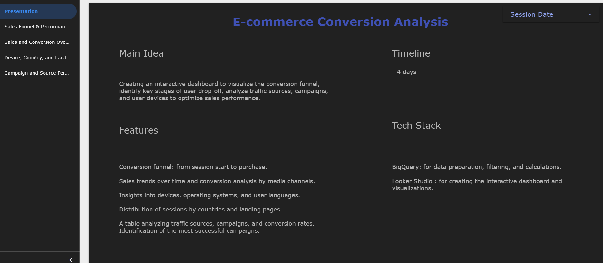
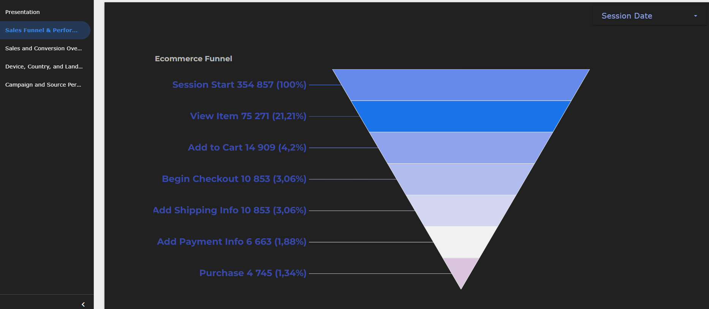
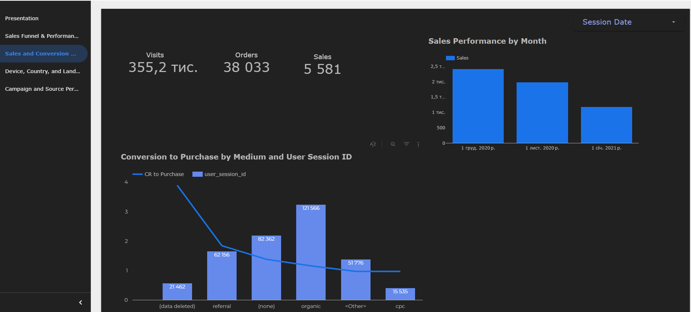
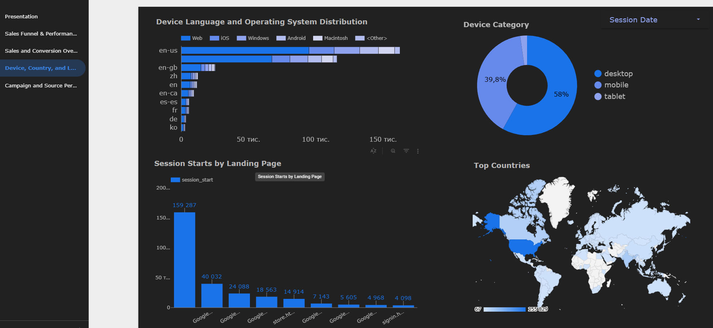
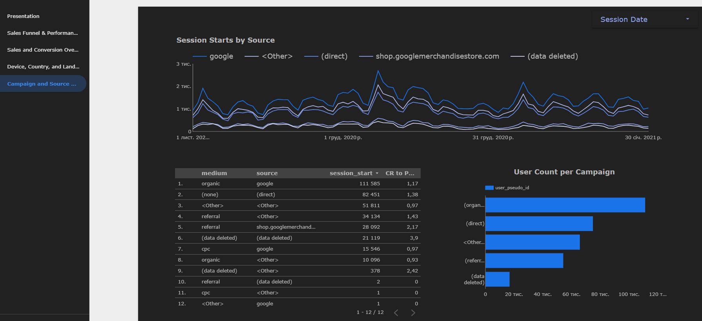

# 🛒 E-commerce Conversion Analysis (Looker Studio + BigQuery)

## 🎯 Goal
Analyze e-commerce user journey and conversion funnel to identify drop-off points, optimize campaigns, and improve sales performance.

## 📊 Data
Dataset with session and purchase logs processed in BigQuery. Data was cleaned, filtered, and prepared for visualization.

## 🔑 Key Metrics
- Conversion funnel (session → view item → add to cart → checkout → purchase)
- Sales trends over time and by media channels
- Conversion rates by device, OS, and language
- User sessions by country and landing page
- Campaign performance and traffic source analysis

## 💡 Insights
- Identified main drop-off points in the purchase funnel.
- Discovered highest-performing traffic sources and campaigns.
- Found device and country patterns in conversion behavior.

## 🖼 Preview
 

## 🛠 Tech Stack
- **BigQuery** → data preparation, filtering, calculations  
- **Looker Studio** → interactive dashboard and visualization  

[View Live Dashboard](https://lookerstudio.google.com/reporting/012da203-b91c-45ad-8318-584d012238b5)

---
